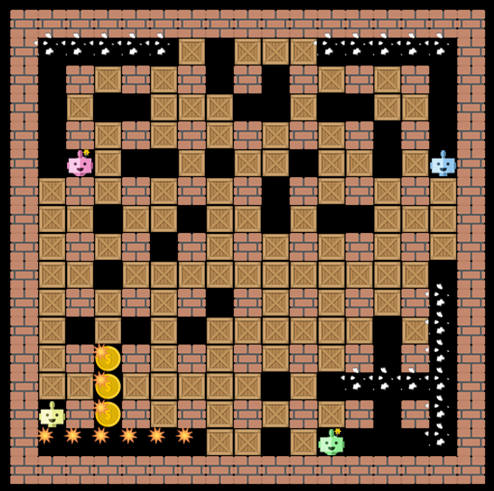
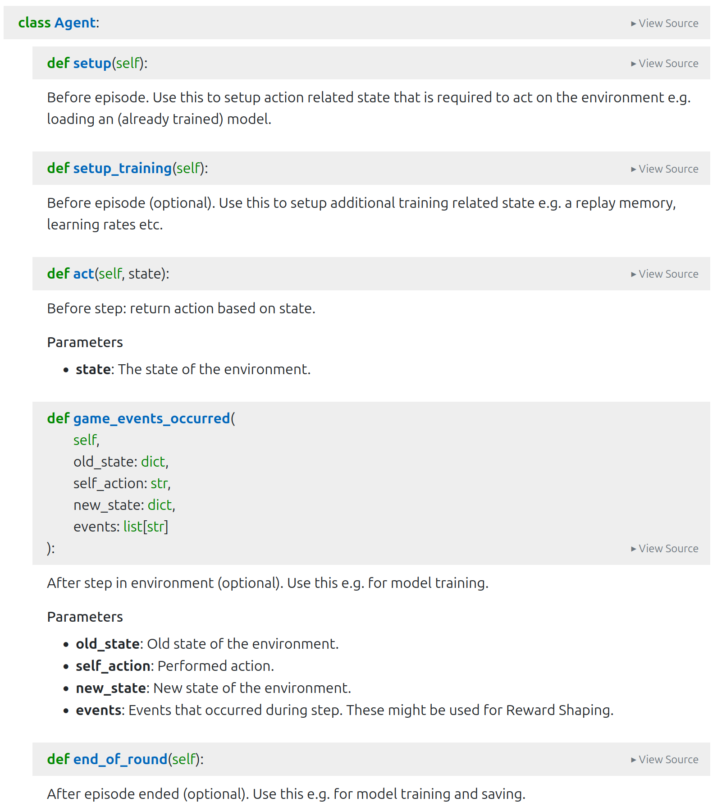

# Bomberman Reinforcement Learning

**Disclaimer: This code is still under development and subject to change.**



## Acknowledgements

This project was [originally developed](https://github.com/ukoethe/bomberman_rl) at the chair of Prof. Dr. Koethe at the university of Heidelberg.

## Description

Student project to train and compete Reinforcement Learning Agents in a Bomberman Environemnt.

## Getting Started

### Prerequisites

- Ideally conda

### Installation

1. Clone the repository:
   ```bash
   git clone https://zivgitlab.uni-muenster.de/ai-systems/bomberman_rl.git
   cd bomberman_rl
   ```

2. Create conda env:
   ```bash
   conda env create --name <name> -f environment.yml
   ```
   This will implicitly install this package as dependency in editable mode.

3. Alternative:
   ```bash
   pip install -e .
   ```
   Manually install further requirements.

### Run
- Watch a random agent play
   ```bash
   python scripts/main.py
   ```
- Play yourself (movement: `Up`, `Down`, `Left`, `Right`; bomb: `Space`, wait: `Enter`)
   ```bash
   python scripts/main.py --user-play
   ```
- Further
    ```bash
   python scripts/main.py -h
   ```

### Develop
This package provides
- `src/`: bomberman *Environment* as Gymnasium environment
- `scripts/`: example *Agent* acting on the environment

#### Environment
- Beware: Gymnasium interface not yet fully implemented!
- tbc

#### Agent
- While you can arbitrarily adapt agent and training loop, you might wanna **stick roughly to the interface** of the example Random Agent as this allows for later competition amongst students

