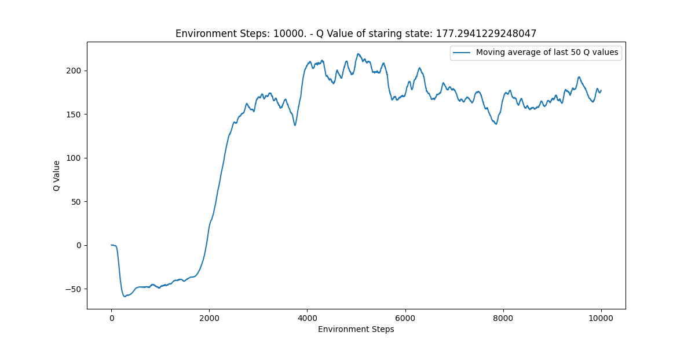

# DQN Agent
From Philipp Honsel, Alexander Hülsmann, Jonathan Wrede

This directory contains an deep reinforcement learning agent for the bomberman game. The agent makes use of:
- **Deep q networks**
  - Normal Q Learning utilizes a state-action value table. For smaller state spaces, that works fine. But since this
    environment has a large state space, a table with an entry for each state would contain a huge amount of data.
    Therefore, we approximate this value by a neural network that learns the values and outputs those on demand, instead
    of saving it in a lookup table.
    
    As with every state, we append two plots per advancement: The Q-Value of the starting state and the reward. Both are
    averaged over the last 50 episodes for a cleaner curve.
    
  - Q Value:
    
    There is _some_ convergence to see in the q value, but it is volatile moving up and down quite a lot.
    
  - Reward:
    
    The reward is quite stable, starting at -100, moving up to -50.
  
- **Epsilon decay**
  - The epsilon greedy was already used in the base deep q network. Using epsilon greedy, the agent will choose a random
    action of the action space, when a random value is below the epsilon-value.
    With epsilon decay, this epsilon value will decrease over time. Therefore the agent will explore a lot in the
    beginning (by choosing random actions) and later depend more on the trained behaviour.

    The code used to implement this epsilon decay is inspired by the code provided as an example in learning agent.
  
  - Q Value:
    
    There is a clear convergence after around 5000 episodes.
    
  - Reward:
    
    The reward is quite stable, starting at -100, moving up to -50, just like the plain deep q network, but with less
    jigger in it.
  
- **Replay Buffers**
  - With replay buffers, the agent saves a tupel of the old state (S_t-1), the action taken in this state (a_t-1), 
    the reward it gained for choosing action A_t-1 in S_t-1 (R_t-1) and the resulting state (S_t).
    Then in every step the algorithm chooses n random (S_t-1, A_t-1, R_t-1, S_t) tupel and trains itself on those.
    Using this approach the experience gained from the environment becomes less correlated between states.
  
    The code used to implement the replay buffer is inspired by the code provided as an example in learning agent.
  
  - Q Value:
    
    There is a clear convergence after 2000 episodes.

  - Reward:
    
    The reward is quite stable for the first 2000 episodes. After that it starts to rise, but then flucuates between 0
    and 80.
    
- **Double Q Learning**
  - As the name suggests, double q learning trains two separate networks. A policy network and a target network. Every n
    steps, the policy network is synced into the target network. The policy network is used to choose the next action,
    while the target network is used to evaluate the chosen action. This reduces over estimation, since the target
    network is used for a longer period of time, instead of updating it every time.

  - Q Value:
    
    There is a clear convergence after 3000 episodes.

  - Reward:
    
    The reward is stable at -40 for the first 2500 episodes. After that it starts to rise, but then flucuates between 0
    and 80.
    On the first look this looks like a worse result than using just the replay buffers, but taking a closer look, the
    average in the end drops a lot (just like in a few occurrences before). So there is no definite way to tell if there
    is a real change from only replay buffers.
  
- **First Reward Structure adjustment**
  - Punishing the agent for moving far away from the middle. When watching the agent play, we noticed that the agent
    just moves around the border and wont explore more of the map. With this punishment we hoped to reduce that 
    behaviour.

  - Q Value:
    
    With no surprise, this change from the other double q learning approach did not change anything at the convergence.
    
  - Reward:
    
    In contrast to the q value, the reward did indeed change. It rose from around 30 to above 80.

## How to

### run
You can choose between using our recommended agent, or every other version from the `q_learning/versions` folder.
The recommended agent is just a copy of the latest episode of the latest version, that being episode 10000 from
including distance to the middle to reward.

To use the recommended agent, just run the program using `python3 main.py`.
If you want to change the agent, replace the `q_learning/agent.pt` file with any other version.

### train
Move this folder to `scripts/q_learning` and adjust line 68 of `main.py` to `agent = QLearningAgent()`.
Then run the program using `python3 main.py --train`.

#### training costs

The latest version ran for 10000 episodes in around 5 hours on a MacBook with M2 Pro chip.
    

## File structure

In the next few paragraphs, the files and their contents are being explained.

The code for the agent is split among a few files for a better separation of concerns:
- agent.py 
- deep_q_network.py
- replay_buffer.py
- state_preprocessor.py
- trainer.py

Additionally, there are another two files, that are indirectly being used:
- features.py
- test.py

### agent.py

This file contains the `QLearningAgent` class, which inherits from the `Agent` class. Therefore, this is the interface
with which the game itself communicates.

This class also holds the deep q network itself

### deep_q_network.py

This file contains the implementation of the deep q network. The class `DQN` inherits from `nn.Module` and has two
important methods:

- get_action: this method returns an action, that the network thinks would work best for the given state
- forward: this method forwards an input tensor to the layers

The layers of the network are defined in the `__init__` method. Right now it consists of the input and output layer
as well as two hidden layers.

### replay_buffer.py

This class is a wrapper arround the python `deque`, which is a "double sided queue".
The wrapper just has two methods for appending and sampling.

### state_preprocessor.py

Since you cannot just input the state dictionary of this environment to the neural network, we need to preprocess the
state. This is done here. There are multiple versions, but as of now v2 is used.

### trainer.py

This file contains the training of the neural network. It has three methods:

- `optimize_single`: Does a single optimization step using the bellman function
- `optimize_replay`: Does mulitple optimization steps using the replay buffer
- `optimize`: The interface for the "outside" of trainer class. This method appends to the replay buffer and decides wether to use `optimize_single` or `optimize_replay

### features.py

To better evaluate the changes to the neural network, features.py contains three feature toggles, where features
(Epsilon decay, Replay Buffers, Double Q Learning) can be toggled on and off.

## Packages and versions

### Numpy - version 2.2.0
We are using numpy for easy access to simple mathematical functions like calculating the mean of an array.
 
### Pytorch - version 2.5.1
Using pytorch for all functions that were using for modelling the neural network.